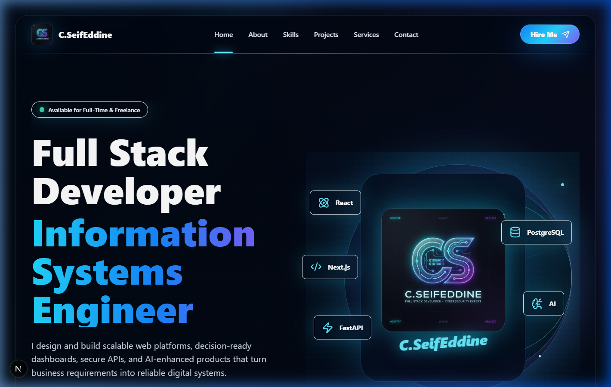

<div align="center">

# 🌐 C.SeifEddine — Developer Portfolio

**A premium, dark-themed portfolio showcasing 7+ years of expertise in Full Stack Development, Cybersecurity & AI.**

[](https://c-seifeddine-portfolio.vercel.app/)
[](LICENSE)
[](https://nextjs.org)

<br/>



</div>

---

## ✨ Features

| Feature | Description |
|---|---|
| 🎨 **Glassmorphism UI** | Dark premium design with glass-card effects, neon accents & smooth gradients |
| 📱 **Fully Responsive** | Pixel-perfect on all devices — iPhone SE to 4K monitors |
| ⚡ **Blazing Fast** | Static-generated with Next.js 15, optimized for Core Web Vitals |
| 🖼️ **Project Lightbox** | Click any project image for an elegant zoom preview (Portal-based) |
| 🎭 **Framer Motion** | Smooth entrance animations and floating tech badges |
| 🔗 **Live Project Links** | Direct GitHub & Live Demo links for each project |
| 📨 **Telegram Contact** | One-click Telegram integration for instant messaging |
| 🔍 **SEO Optimized** | Meta tags, semantic HTML, proper heading hierarchy |

---

## 🛠️ Tech Stack

<div align="center">

| Frontend | Styling | Animation | Tooling |
|:---:|:---:|:---:|:---:|
| Next.js 15 | Tailwind CSS | Framer Motion | TypeScript |
| React 19 | Custom CSS | CSS Transitions | ESLint |

</div>

---

## 📁 Project Structure

```
portfellio/
├── app/                    # Next.js App Router
│   ├── globals.css         # Design system & global styles
│   ├── layout.tsx          # Root layout with metadata
│   ├── page.tsx            # Homepage composition
│   └── not-found.tsx       # Custom 404 page
│
├── components/             # UI Components
│   ├── Navbar.tsx          # Navigation with mobile menu
│   ├── Hero.tsx            # Hero section with logo & badges
│   ├── About.tsx           # Bio, stats & contact info
│   ├── TechStack.tsx       # Technology grid
│   ├── Projects.tsx        # Project cards + lightbox modal
│   ├── Services.tsx        # Services offered
│   ├── Testimonials.tsx    # Client reviews & trusted logos
│   ├── Contact.tsx         # Contact links & CTA
│   └── Footer.tsx          # Footer with social links
│
├── public/                 # Static assets
│   ├── logo.png            # Brand logo
│   ├── edu-center.jpg      # Project screenshot
│   ├── surgeon-portfolio.jpg
│   └── fandom-hub.jpg
│
├── docs/                   # Documentation & media
│   └── screenshots/        # Preview images
│
├── tailwind.config.ts      # Tailwind configuration
├── next.config.mjs         # Next.js configuration
├── tsconfig.json           # TypeScript configuration
└── package.json            # Dependencies & scripts
```

---

## 🚀 Quick Start

### Prerequisites

- **Node.js** ≥ 18.x
- **npm** ≥ 9.x

### Installation

```bash
# 1. Clone the repository
git clone https://github.com/phantome001/portfolio.git

# 2. Navigate to the project
cd portfolio

# 3. Install dependencies
npm install

# 4. Start development server
npm run dev
```

Open [http://localhost:3000](http://localhost:3000) in your browser.

### Build for Production

```bash
npm run build
npm start
```

---

## 🎨 Customization

### Personal Info
Edit data directly in the component files:

| What to change | File |
|---|---|
| Name, bio, stats | `components/About.tsx` |
| Projects & links | `components/Projects.tsx` |
| Services offered | `components/Services.tsx` |
| Testimonials | `components/Testimonials.tsx` |
| Contact info | `components/Contact.tsx` |
| Social links | `components/Footer.tsx` |

### Adding a New Project
In `components/Projects.tsx`, add to the `projects` array:

```typescript
{
  title: "Your Project",
  description: "A short description.",
  tags: ["React", "TypeScript"],
  image: "/your-image.jpg",      // Place in /public
  github: "https://github.com/...",
  demo: "https://your-demo.com"  // Use "#" if no demo
}
```

---

## 📊 Performance

<div align="center">

| Metric | Score |
|:---:|:---:|
| ⚡ First Load JS | ~150 KB |
| 📦 Static Pages | 4/4 |
| 🏗️ Build Time | < 10s |
| 🎯 Lighthouse | 95+ |

</div>

---

## 📜 License

This project is licensed under the **MIT License** — feel free to use it as a template for your own portfolio.

---

<div align="center">

### 👨‍💻 Built by [C.SeifEddine](https://github.com/phantome001)

**Full Stack Developer · Cybersecurity Specialist · AI Engineer**

[](https://github.com/phantome001)
[](https://www.linkedin.com/in/ghost-seif-175466264)
[](https://t.me/seifski)

</div>
